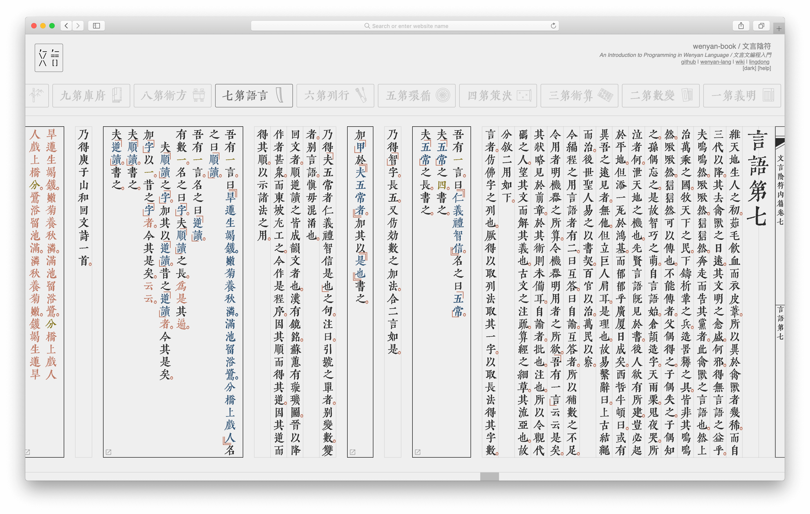
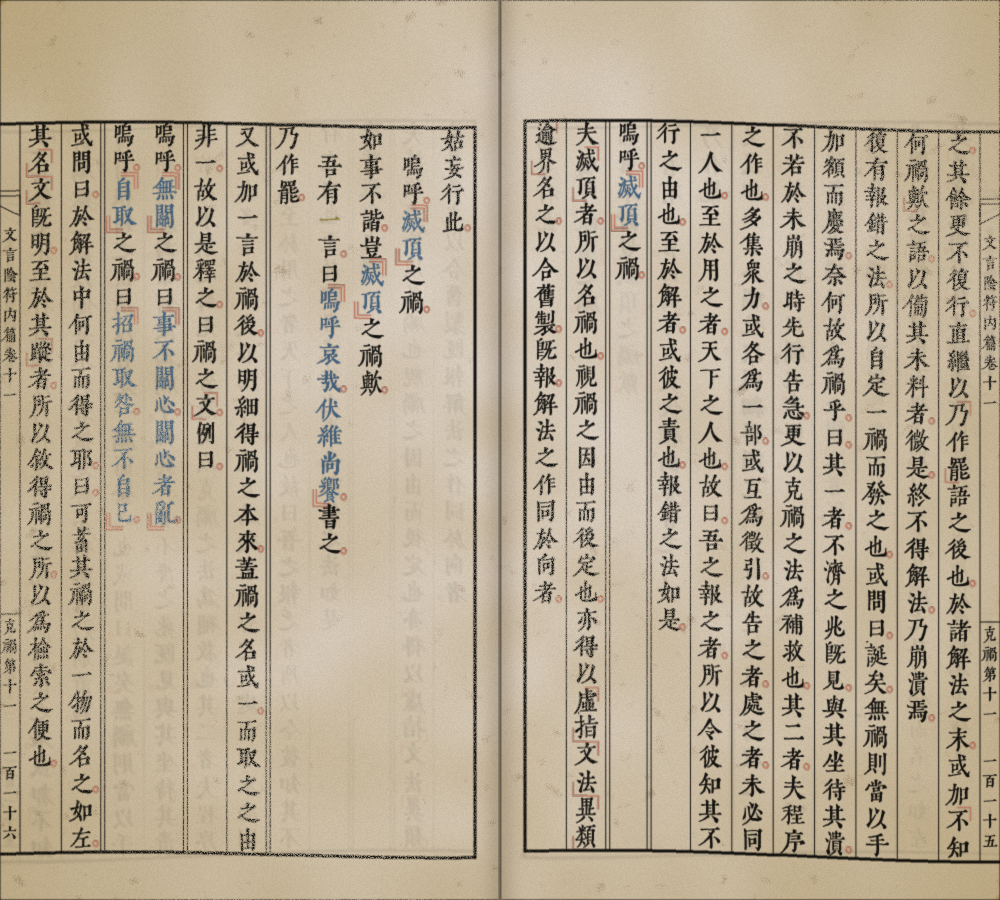
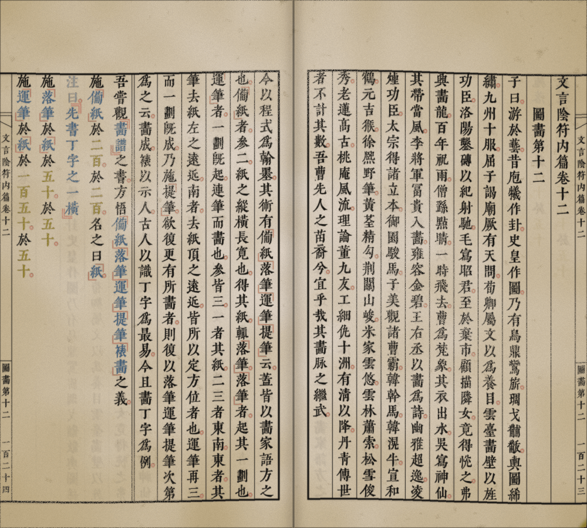

# wenyan-book《文言陰符》

*An Introduction to Programming in Wenyan Language*

文言文編程入門: The official [wenyan-lang](https://wy-lang.org) handbook, written in Classical Chinese.

> 編程者何？所以役機器也。機器者何？所以代人力也。然機器之力也廣，其算也速，唯智不逮也。故有智者慎謀遠慮，下筆千言，如軍令然，如藥方然，謂之程式。機器既明之，乃能為人所使。或演星文，或析事理，其用豈止萬端。問曰：機器者，物也，銅鐵也，何能為而能識人之語，而為人之使耶？曰：此所以有編程語言也。人之所常言，辭或斐然，典或奧雅，機器故不能解。然機器所解者，則寥寥然二三言也。曰與、曰或、曰非。此皆至元之辭，人又未易用之。故取其中庸之道，倣人之所言，取其精煉明要者，點竄典字，嚴定其義。上足觀之而為人之用，下足譯之而為機器所解。是謂編程語言也。古有算經，易有繫辭，其用雖不同，語如其類也。
> 
> ── 《文言陰符內篇•明義第一》

## [Read Online](https://book.wy-lang.org)

 
## Download PDF

### 【[Relic Edition](https://github.com/wenyan-lang/book/releases)】【[Remastered Edition](assets/wenyan-book.pdf)】

([alternative link](https://cdn.jsdelivr.net/gh/wenyan-lang/book/assets/wenyan-book.pdf))

## 目錄 Table of Contents

- [明義第一](01%20明義第一.md)
- [變數第二](02%20變數第二.md)
- [算術第三](03%20算術第三.md)
- [決策第四](04%20決策第四.md)
- [循環第五](05%20循環第五.md)
- [行列第六](06%20行列第六.md)
- [言語第七](07%20言語第七.md)
- [方術第八](08%20方術第八.md)
- [府庫第九](09%20府庫第九.md)
- [格物第十](10%20格物第十.md)
- [克禍第十一](11%20克禍第十一.md)
- [圖畫第十二](12%20圖畫第十二.md)
- [宏略第十三](13%20宏略第十三.md)

## Translations

- [Japanese Kanbun version by @747](https://gitlab.com/yheuhtozr/book-ja-kanbun)
- [Simplified Chinese version by @zuorong-zhang](https://github.com/zuorong-zhang/wybk-slcn)

## Contributing

> 雖實覆甕之質，尚存斧正之望；雖乏呂相之金，易字之渴蓋同。

If you'd like to suggest an edit, please discuss in an Issue before opening a PR, thanks!
